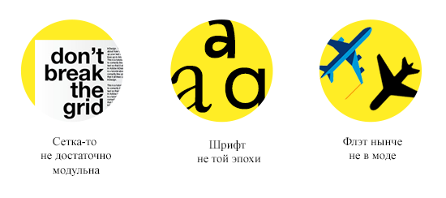
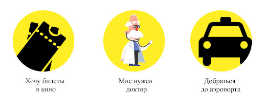
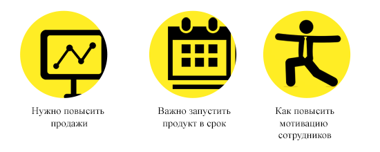
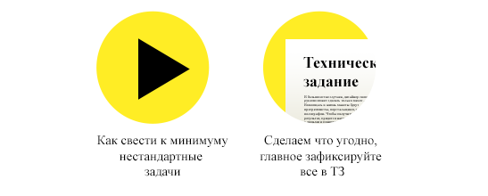

# Дизайнер продуктов. База дизайн-мышления.

В рассылке мы будем говорить о дизайнерах продуктов и услуг. Чтобы говорить на одном языке, стоит определить, чем дизайнер продуктов отличается от других дизайнеров.

Дизайнер продукта это тот, кто определяет как будет выглядеть продукт, и как пользователь будет взаимодействовать с ним.

Дизайнеров можно делить по сферам деятельности: дизайнеры интерфейсов, фэшн дизайнеры, дизайнеры интерьеров, гейм-дизайнеры и т.д.. Можно копать еще глубже: графические дизайнеры, дизайнер иконок, техдизайнеры, 3Д дизайнеры.

Я же делю здесь дизайнеров, по способу мышления, на дизайнеров макетов и продуктовых дизайнеров. Не важно в какой сфере они работают. Принципиальное различие между ними в результате их работы: дизайнер макетов продает клиенту макеты, продуктовый дизайнер продаёт рабочий продукт.

> Продуктовый дизайнер продаёт рабочий продукт, а не макеты

Что это значит? Например, дизайнер получает задание сделать меню для кофейни. Открывает задание от клиента, верстает макет, согласовывает с клиентом и идет отдыхать. Работа сделана. Клиент забирает макет, отдает в печать.

> Мой опыт. Я сделал меню товарищу на скорую руку, отдал макет и забыл. Не проконтролировал, не заполнил реальными данными. Результат получился соответственный.

Дело в том, что бумагу выбирал кто-то в типографии. Когда нарезали меню, чуть-чуть забили на отступы. Может там человек без вкуса сидел, я не знаю. Клиент этого не заметил. Ну ой. А еще, в последний момент оказалось, что каких-то позиций пока нет в меню, и клиент сам убрал из меню две позиции. Дизайнер однажды приходит в кофейню, просит меню и «О боже!».

Так устроена работа у дизайнера макетов. Кто виноват? Непонятно. Каждый сделал свою работу.

У продуктового дизайнера работа заканчивается, когда меню ложится на стол перед посетителем кофейни. Т.е. после того как согласован макет, идет утверждение позиций, вычитка, выбор бумаги, печать. И дизайнер это все контролирует. Когда мы подержали меню в руках, убедились что все ок, можно запускать в тираж. Работа сделана.

### Это ключевое различие. Вот ещё несколько:

| Дизайнер макетов   | Дизайнер продукта |
| -- | -- |
| Работает в фотошопе | Общается, задает вопросы, предлагает решения |
| Результат работы: утвержденный макет | Результат работы: работающий продукт |
| Выполняет работу сам | Делегирует большую часть рутинной работы |
| Не знает о целях бизнеса | Знает цели и сверяется с ними |
| Отдаляется от клиента | Постоянно общается с клиентом |
| Винит программистов в плохой реализации макетов | Руководит программистами |

Может показаться, что дизайнер продуктов менее творческая профессия и более менеджерская. На самом деле это разные уровни творчества. Дизайнер продуктов действительно больше скетчит, пишет и общается с людьми. Его творчество — продукт. Каждый реализует творческую энергию так, как ему удобнее. Если вас тошнит от общения, ответственности и инженерных задачек, лучше остаться в макетах — такие дизайнеры тоже нужны рынку.

### Четыре мира продукта

Большинство дизайнеров развиваются только в мире макетов: фотошопы, градиенты, сетки, композиция, типографика и т.д. Это все хорошо и важно. Этого достаточно, чтобы создать хороший макет. Дизайнер продуктов не удовлетворен макетом в фотошопе, потому что знает — это просто картинка. Чтобы реализовать её предстоит выполнить кучу работы. Он успокаивается только когда видит запущенный продукт.

Продукт всегда создается на пересечении четырех миров: бизнеса, пользователей, производства и дизайна. Чтобы продукт был качественным, дизайнер работает во всех четырех.

### Мир дизайнера

Цель в мире дизайнера: сделать крутой макет. Дизайнер всегда хочет подобрать интересное визуальное решение, самовыразиться. 

В мире дизайнера вы развиваетесь скорее как художник. Тут можно делать макеты в вакууме. Расставлять элементы в модульной сетке. Подбирать цвета, вырисовывать кнопки, наклонять голову и ощущать композицию, думать о форме и спорить о межбуквенном расстоянии. Эти навыки жизненно необходимы дизайнеру. С помощью них вы придаете форму продукту, которая радует глаз. Большая часть работ на бехансах сделана только в мире дизайна.

### Мир пользователя

Цель пользователя всегда разная, но в общем её можно сформулировать как: удовлетворить потребность. 

Пользователь рад, когда его задачи решаются без особого труда. А если еще и эстетически все приятно, то вообще гуд. Но это не принципиально. Чтобы попасть в мир пользователя нужно научиться ставить себя на место пользователей, думать об их целях, понимать какую пользу они ожидают. Любой продукт создан для того, чтобы решать проблемы пользователя. Задача дизайнера помнить, что макет, создается не для дизайнера, а для пользователя.

### Мир бизнеса

Это тот самый мир, из-за которого у большинства дизайнеров проблемы с клиентами. Бизнесом я называю заказчика — того человека, который поставил вам задачу.

У бизнеса есть своя цель: зачем он создает этот продукт. У него есть видение, как этот продукт взаимодействует с пользователем, кто этот пользователь. Из этого вытекает задача. Дизайнер должен уметь понимать задачу, выполнять ее и сдавать. Это значит придется изучить темы общения с людьми, психологии, публичных выступлений и управлении проектами. Из-за того, что дизайнер не погружается в мир бизнеса, он не может сдать проект и его «клиент дурак и хочет плохой дизайн».

###Мир производства

В большинстве случаев дизайнер своими руками может сделать только макет. Воплощать в жизнь макеты будут программисты, верстальщики, заводы, полиграфии. Чтобы получить задуманный результат, придется научиться контактировать с людьми и понимать тонкости производства.

На одной из работ я услышал от программиста фразу: «не везет вам, дизайнерам - каждый раз нужно что-то новое придумывать. Я вот один раз код написал и использую его везде». Так работает производство. У них нет целей удовлетворить пользователей, сделать оригинально или повысить продажи. Их главная цель — делать.

Не всегда производство не хочет что-то делать. Иногда реализовать задуманное невозможно. Или возможно, но очень дорого. Когда дизайнер понимает технологию производства, он будет строить гипотезы более точно.

> Когда дизайнер понимает технологию производства, он строит гипотезы более точно

Лёша Рева

